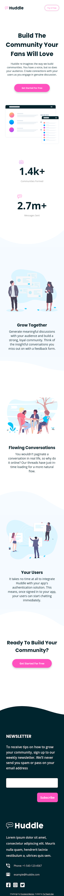

# Frontend Mentor - Huddle landing page with curved sections solution

This is a solution to the [Huddle landing page with curved sections challenge on Frontend Mentor](https://www.frontendmentor.io/challenges/huddle-landing-page-with-curved-sections-5ca5ecd01e82137ec91a50f2). Frontend Mentor challenges help you improve your coding skills by building realistic projects.

### The challenge

Users should be able to:

-   View the optimal layout for the site depending on their device's screen size
-   See hover states for all interactive elements on the page

### Screenshot

-   Desktop Version

-   Mobile Version

### Links

-   [Live site URL here](https://tathanhdat.github.io/huddle-landing-page-with-curved-sections/)

### Built with

-   Semantic HTML5 markup
-   CSS custom properties
-   Flexbox
-   CSS Grid
-   Mobile-first workflow

## Author

-   Facebook - [Ta Thanh Dat](https://www.facebook.com/tathanh.dat.5/)
-   LinkedIn - [Ta Thanh Dat](www.linkedin.com/in/ta-thanh-dat-a0a971199)
-   Frontend Mentor - [@Ta Thanh Dat](https://www.frontendmentor.io/profile/tathanhdat)
